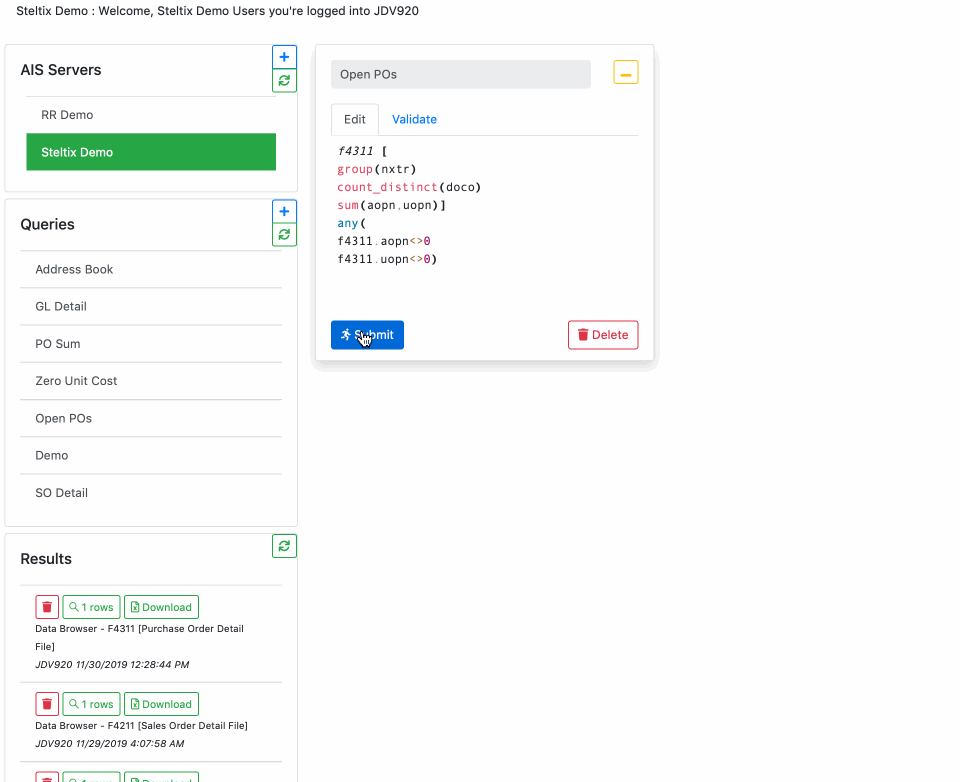

## Data Browser Features

> [Try Live Demo](https://io-celin-databrowser.azurewebsites.net)

> [Explore on Github](https://github.com/Herdubreid/DataBrowser)

### Complex Queries

Join `all` / `any` condition with optional `and` / `or` keyword (defaults to `and`) for a Complex Query.  The first step of the above example selects all PO lines where either Open Amount (AOPN) or Open Units (UOPN) is not zero.  The second step limits the selection to next status (NXTR) starting with `2`, `3` or `4`.

