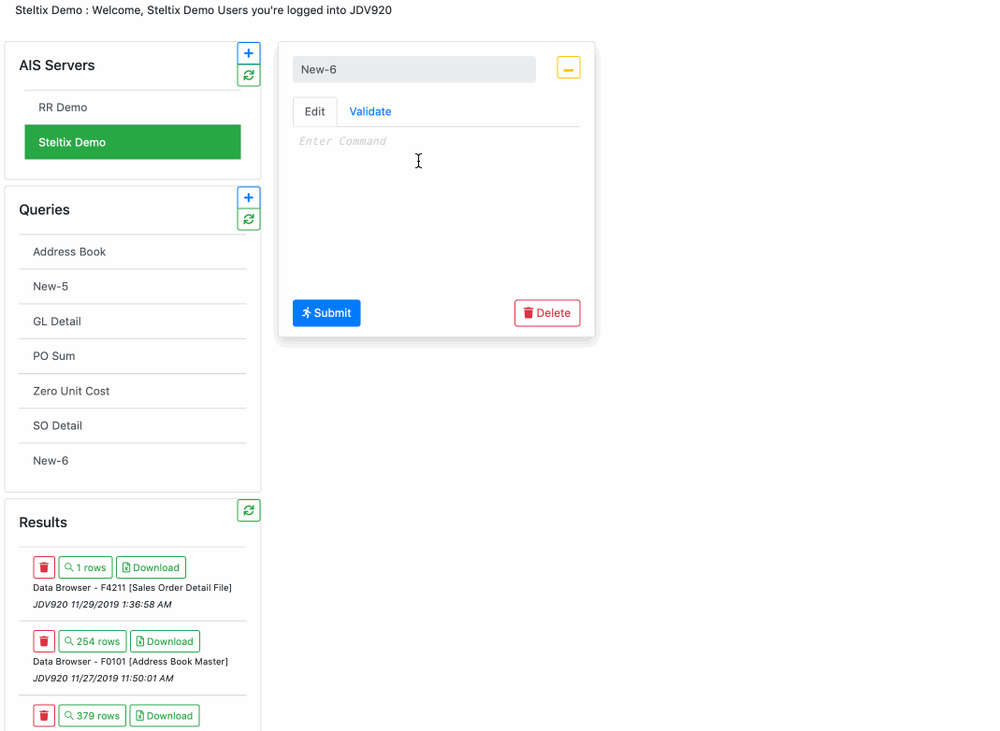

## Data Browser Features

### Complex Queries

Join `all` / `any` condition with optional `and` / `or` keyword (defaults to `and`) for a Complex Query.  The first step of the above example selects all PO lines where either Open Amount (AOPN) or Open Units (UOPN) is not zero.  The second step limits the selection to next status (NXTR) starting with `2`, `3` or `4`.

### Field List

The `demo` option lists the fields in a table of view along with data type, denoted as `X` for Strings, `0` for Numbers and `19700101` for dates (the Unix epoch).

The list can be filtered by name or data type.

### Syntax Highlighting Query Editor

Syntax highlighting has been around for few decades and considered an indispensable feature of any code editor.  Having recognised terms styled in italic like the subject or color coded like the `all` keyword and `=` operator makes the query more readable and syntax errors less likely.

### Compare Results

Submit the same Query to different environment and compare the results.

Query Results are automatically saved on the Azure File System with a date-time stamp and source environments, which also makes for ideal `before-after` test scenarios.

### Export to Excel

The Excel download converts the result into an Excel spreadsheet with value type preservation.  This means that values that look like numbers are not automatically converted to number -- account `40.2020` is not stripped to the number `40.202` for example, as a `.csv` conversion might do.

### Information Sharing

Because the back-end persist the data with the Azure File System, it can be shared.  For example user A on the left side above writes and validates a Query that user B on the right side then opens up and executes.  User A on the left side can then view the results.
